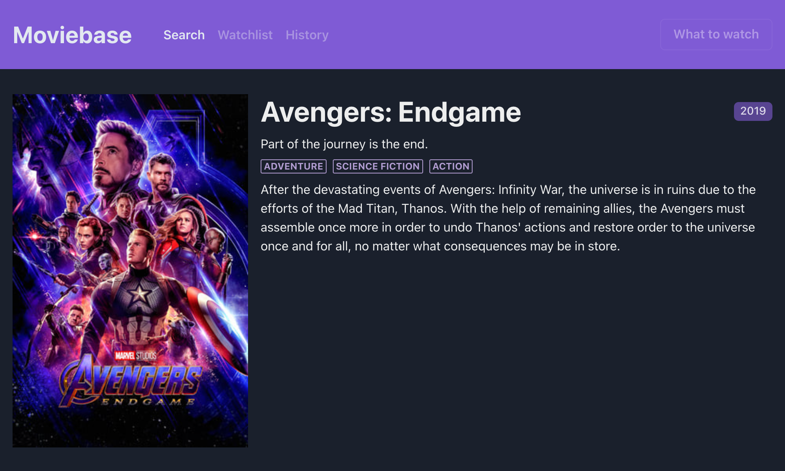

# Moviebase



## Primii pași

1. Fork la acest repo
2. `git clone` la forkul nou creat (nu acest repo)
3. `npm install` pentru a descărca toate dependențele necesare
4. Creează un branch nou `project` din `main` și lucrează pe el
5. Oferă-mi access la fork, de pe GitHub `settings/access`, invită un colaborator, caută
   `victor@locoman.ro`
6. Adaugă 2-3 colegi la colaboratori ca să vă ajutați reciproc prin feedback la cod/soluție
7. Copiază fișierul `.env.example` în `.env.local` și completează-l

## Rularea proiectului

1. rulează instrucțiunea `npm run dev` - va porni serverul local
2. intră pe http://localhost:3000/, ar trebui să vezi mesajul "Moviebase is up and running"

## Tehnologii folosite

### [next.js](https://nextjs.org/docs/getting-started)

Este serverul nostru și are grijă ca partea de React să se încarce cum trebuie.

### [react](https://reactjs.org/docs/hello-world.html)

Se ocupă de UI. Noi scriem componente care depind de `state`. React are grijă să afișeze în DOM
componentele noastre în dependență de `state`. Matematic vorbind:

```
UI = React(state)
```

Folosim [🪝hooks](https://reactjs.org/docs/hooks-intro.html) pentru cod frumos.

### [chakra-ui](https://chakra-ui.com/docs/principles)

Ne permite să scriem CSS fără să scriem CSS 🤩. Și mai are și multe componente gata făcute. Nu e
nevoie să-l folosiți pentru a scrie cod, CSS-ul poate fi folosit în continuare. Dar, există opțiunea
să o faceți mai simplu, diferit.

### [swr](https://swr.vercel.app/)

Are grijă de operațiile async din React.

### [mongodb](https://docs.mongodb.com/drivers/node/usage-examples)

O bază de date populară.

### [TMDB](https://developers.themoviedb.org/3/search/search-movies)

The Movie Database oferă un API puternic, bogat în funcționalități. De la ei vom lua filmele și tot
ce ne interesează despre filme.

---

### Q: E necesar să folosesc toate aceste instrumente?

A: Nu e necesar, sunt doar alegerea mea. Te invit să înlocuiești oricare din ele după bun plac. E un
exercițiu bun să faci același proiect cu tehnologii diferite.

## Arhitectura aplicației

### Problema

Utilizatorul dorește să privească un film și are nevoie de ajutor să aleagă filmul potrivit.

### Soluția

Ii oferim o aplicație prin care să poată salva filmele favorite și filmele privite. Pe baza acestor
informații vom oferi recomandări.

Vom face o aplicație web unde utilizatorul va putea căuta filmele preferate, și apoi le poate salva
în favorite/istoric. Informația despre filme va fi luată de pe TMDB prin API-ul lor. Stocarea
informațiilor se va face în baza noastră de date, care o vom putea accesa printr-un server.
Recomandările le vom face pe baza informațiilor din BD.

## Structura proiectului

- `components` - componente de React, orice nu este pagină
- `pages` - paginile aplicației, pentru fiecare fișier, va exista o rută
  - `api` - rutele de backend, asemănător cu cele din express
- `public` - fișierele statice pentru React
- `utils` - Câteva funcții refolosite prin cod
- `env.example` - fișierul de configurare ce trebuie copiat în `.env.local`

## Sarcini

Acum să trecem la muncă.

1. Deschide `README.md` în VS Code. O să verzi sursa textului în format Markdown. E chiar simpatic,
   dar dacă vrei să-l vezi ca și pe GitHub, apasă `Preview` din bara de sus. Acum, după ce ai
   completat un task, ~~✂️ îl tai de aici~~.
2. _Vom adăuga partea de watchlist, istoric, recomandări..._
